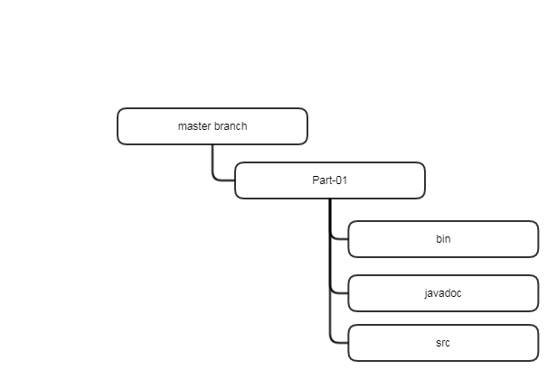

## Glints Assessment

## Table Of Contents

[Binary Files]{#Binary-Files}

## Repository Structure

Repository named glints-assessment is created for keeping source and related files that are part of both the assessments. i.e. Part 1, coding assessment and Part 2, web app.

Refer to the image below for an overview of the respository structure

A description of the folders under master branch is given in the table below. 

SlNo | Folder                  | Description
-----|-------------------------|-------------
1    | master/Part 01          | Top level folder contains files and sub folders related to Part 1, coding assessment
2    | master/Part 01/bin      | Contains compiled class files. These are executable binary files.
3    | master/Part 01/javadoc  | Contains source documentation files
4    | master/Part 01/src      | Contains source files

## Part 01 - Coding Assessment

#### Programming Language and Development Environment
---
The solutions to all 3 problems have been developed using **Java Standard Edition 7 (Java SE 7) 64 bit** on a **Windows 7 64 bit** PC. **Java Development Kit (JDK 1.7)** is used to compile and test the code.

#### Source Files
---
Java source files are located at **master/Part 01/src** folder with the extension .java. Details of source files are summarized in the table given below.

File Name                | Description
-------------------------|--------------------------
Factorial.java           | Code for solving problem 1, find factorial of a given number. 
ArraySort.java           | Code for solving problem 2, sort an array in ascending order.
MatrixRotation.java      | Code for solving problem 3, rotate a matrix. Depends on Matrix.java.
Matrix.java              | Dependency for MatrixRotation.java.
                         
#### Binary Files
---
Java binary files are located at **master/Part 01/bin** folder with extension .class. Binary files can be executed using a **JRE (Java Runtime Environment)** in a PC. For more details on running the binaries please refer to section TODO. Details of binaries are summarized in table given below.

File Name                | Description
-------------------------|---------------------------
Factorial.class          | Obtained by compiling source file Factorial.java
ArraySort.class          | Obtained by compiling source file ArraySort.java
MatrixRotation.class     | Obtained by compiling source file MatrixRotaion.java
Matrix.class             | Obtained by compiling source file Matrix.java. Dependency for MatrixRotation.class

#### Running The Binaries
---
Because, the binaries available in the repository are compiled and tested using a **Windows 7 64 bit** PC, the instructions given in this section assumes an equivalent execution environment. Since, Java binaries are platform independend, it is quite possible to run the binaries in an OS other than **Windows 7 64 bit**. Please follow the instructions given below.
* **Recommended Java runtime - JRE version 7 or higher**
* **Download the source file into a folder in a PC**
* **Open console (In Windows it is the Command Prompt) and change directory to the folder where binaries are downloaded**
* **Use command _java filename_, where _filename_ is the name of the binary (.class) file without the extension. See example below**

    **E.g. java Factorial, will execute the binary Factorial.class**
    
Follow the instructions given above to run any binary file available in the repository.

